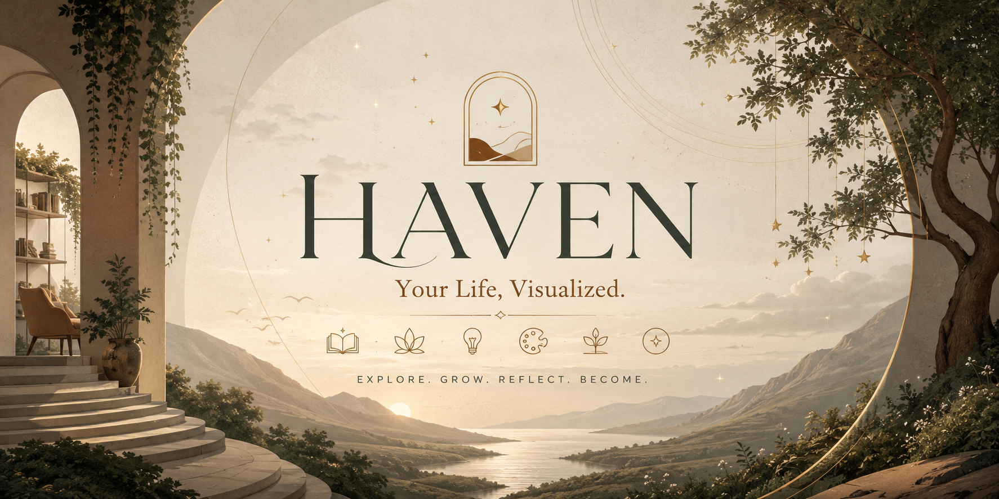

<div align="center">



<br>

# HAVEN

### Your Life, Visualized.

**An interactive digital world for learning, wellness, creativity, habits, and reflection.**

<br>


<br>


</div>

---

# About HAVEN

**HAVEN** is an interactive front-end experience developed as part of the **LiftClub Internship Program**.

The project explores how a digital interface can transform everyday personal growth into something more visual, engaging, and human.

Instead of presenting wellness and productivity through traditional dashboards, HAVEN creates a small interactive world where:

* Learning becomes a constellation.
* Wellness becomes a garden.
* Ideas become something to grow.
* Habits become visible progress.
* Everyday moments become personal traces.

> **The small things that make up your life deserve somewhere to grow.**

---

# LiftClub Internship Project

**Project:** HAVEN — Your Life, Visualized
**Program:** LiftClub Internship
**Focus:** Front-End Development & Interactive UI
**Type:** Individual Internship Project
**Status:** Completed

This project was created to apply practical front-end development skills in a complete interactive web experience.

The development process focused on turning an initial concept into a functional, responsive, and visually distinctive website.

---

# Explore HAVEN

### 01 · Knowledge

A visual space for curiosity and learning.

Explore topics, collect knowledge, and turn learning into something memorable.

### 02 · Wellness

A calmer space for breathing, movement, and simple daily rituals.

### 03 · Innovation

A structured space for moving ideas forward.

**Define → Build → Test → Share**

### 04 · Creativity

A visual garden for unfinished thoughts, inspiration, and ideas that deserve somewhere to grow.

### 05 · Grow What Matters

A personal habit space where small commitments become visible progress.

Add habits, complete them, and watch your progress develop.

### 06 · Small Things Count

A living memory wall for everyday moments.

Record things you:

**Noticed · Learned · Created · Cared**

Your entries become a visual constellation of your day.

---

# Key Features

* Interactive visual environments
* Knowledge exploration
* Wellness activities
* Innovation workflow
* Creativity garden
* Habit tracking
* Progress visualization
* Daily reflection
* Personal memory traces
* Interactive cards
* Animated visual elements
* Responsive design
* Local data persistence
* No account required
* No backend required

---

# Technology Stack

### Frontend

| Technology     | Purpose                                       |
| -------------- | --------------------------------------------- |
| **HTML5**      | Structure and semantic content                |
| **CSS3**       | Layout, styling, animations and visual system |
| **JavaScript** | Interactivity and application logic           |

### Browser APIs

**LocalStorage API**
Used to preserve habits, reflections, and personal traces between sessions.

**DOM API**
Used to dynamically create and update interface elements.

**CSS Animations**
Used to create movement, transitions, floating elements, and visual feedback.

---

# Design Philosophy

HAVEN intentionally moves away from the conventional productivity-dashboard aesthetic.

The visual direction combines:

* Warm neutral backgrounds
* Earthy tones
* Elegant serif typography
* Organic shapes
* Illustrated landscapes
* Soft gradients
* Floating elements
* Subtle animations
* Editorial-inspired layouts
* Spacious composition

The goal is to make HAVEN feel less like a tool and more like **a place you can return to.**

---

# What Makes HAVEN Different?

Many productivity applications focus heavily on:

**Numbers · Streaks · Tasks · Notifications · Statistics**

HAVEN explores a softer alternative.

Instead of asking:

> *How productive were you today?*

HAVEN asks:

> *What did you notice, learn, create, care about, or grow today?*

The project combines **functionality, interaction, and visual storytelling** into one experience.

---

# Project Structure

```text
HAVEN/
│
├── index.html
│
├── assets/
│   ├── css/
│   │   └── style.css
│   │
│   ├── js/
│   │   └── main.js
│   │
│   └── images/
│       └── ban.png
│
└── README.md
```

---

# Getting Started

### Clone the repository

```bash
git clone https://github.com/YOUR-USERNAME/HAVEN.git
```

### Open the project

Open the `HAVEN` folder in VS Code.

### Run locally

Open `index.html` in your browser or use the **Live Server** extension in VS Code.

No installation or backend setup is required.

---

# Data & Privacy

HAVEN does not require an account or external database.

Interactive information such as habits, reflections, and personal traces is stored locally in the browser using the **LocalStorage API**.

This keeps the experience lightweight and allows the project to function without a server.

---

# Learning Outcomes

Developing HAVEN provided practical experience with:

* HTML5 structure
* CSS architecture
* Responsive web design
* JavaScript
* DOM manipulation
* Event handling
* LocalStorage
* Dynamic UI rendering
* CSS animations
* Interactive components
* Browser debugging
* User-centered design
* Visual storytelling

---

# Future Possibilities

HAVEN could eventually evolve into a larger personal companion with:

* AI-powered reflection
* Personalized daily journeys
* Mood tracking
* Habit insights
* Journaling
* Cloud synchronization
* User accounts
* Personalized environments
* More wellness experiences

---

# Project Status

**Completed**

HAVEN is currently a browser-based interactive front-end experience developed as part of the **LiftClub Internship Program**.

The project demonstrates the combination of **front-end development, interaction design, responsive UI, and creative visual storytelling.**

---

# Author

**Ayesha Zaib Warraich**

BS Artificial Intelligence
University of Agriculture Faisalabad

---

<div align="center">

### HAVEN

*Make room for what matters.*

**LiftClub Internship Project · 2026**

</div>
